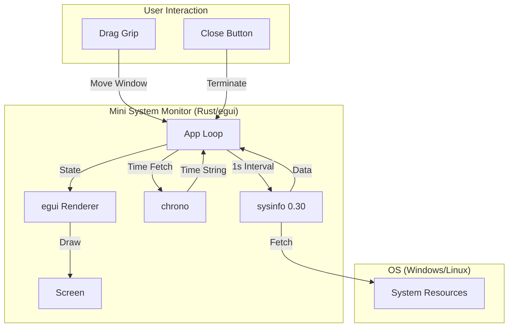

# System Diagram

```mermaid
graph TD
    subgraph "OS (Windows/Linux)"
        SYS[System Resources]
    end

    subgraph "Mini System Monitor (Rust/egui)"
        APP[App Loop]
        SI[sysinfo 0.30]
        CH[chrono]
        UI[egui Renderer]
        
        APP -->|1s Interval| SI
        APP -->|Time Fetch| CH
        SI -->|Fetch| SYS
        SI -->|Data| APP
        CH -->|Time String| APP
        APP -->|State| UI
        UI -->|Draw| SCR[Screen]
    end

    subgraph "User Interaction"
        DRAG[Drag Grip] -->|Move Window| APP
        CLOSE[Close Button] -->|Terminate| APP
    end
```
