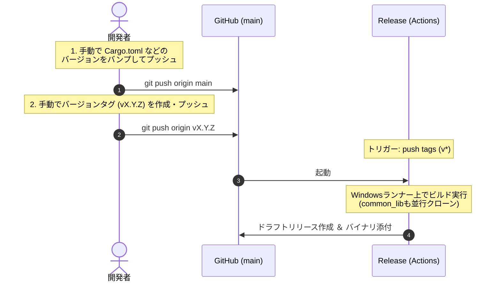

# リモートリリースおよびバージョン管理フロー手順書

本ドキュメントでは、Mini System Monitor (MiSysMon) におけるGitHub Actionsを利用したリリースビルド（`.exe`アセット付ドラフトリリース）の作成フローとトラブルシューティングについて解説します。

---

## 1. 全体フロー概要

リリースプロセスは、開発者が手動でバージョンバンプおよびタグをプッシュすることでトリガーされます。



---

## 2. 各ワークフローの役割

### ① Release (`release.yml`)
- **トリガー**: `v*` で始まるバージョンタグがGitHubにプッシュされた時。
- **処理内容**:
  1. `MiSysMon` と `common_lib` の双方のリポジトリを並行クローンする。
  2. Windows環境（`windows-latest`）上で、最適化オプションを適用してリリース用バイナリ（`mini-system-monitor.exe`）をビルドする。
  3. ビルドされたバイナリを添付し、GitHub上に「Draft Release（下書きリリース）」を自動作成する。

---

## 3. リリースおよびタグのプッシュ手順

リリースを公開するための標準的な手順は以下の通りです。

### 1. バージョンのバンプとプッシュ
手動で `Cargo.toml` や `docs/SPEC.md` などのバージョン表記を更新し、`main` ブランチにコミットしてプッシュします。
```bash
git commit -a -m "chore(release): release v1.0.0"
git push origin main
```

### 2. リリースタグのプッシュ
プッシュした最新のコミットに対してタグを作成し、プッシュします。
```bash
git tag v1.0.0
git push origin v1.0.0
```
これにより、GitHub Actions 上でリリースビルドワークフローが起動し、自動的にバイナリ付きのドラフトリリースが作成されます。

---

## 4. トラブルシューティングと手動操作

### Q1. 手動でタグをプッシュしたのにActionsが動かない
**原因**: プッシュしたタグが指しているコミットが、すでに別のタグで実行済みのコミットと同じである場合、GitHub Actionsは重複実行を防止するためトリガーをスキップします。
**解決策**: タグを打ち直すか、新しいコミットを作ってからタグを付与します。
1. リモートとローカルのタグを一度削除します。
   ```bash
   git push origin :refs/tags/v1.0.0
   git tag -d v1.0.0
   ```
2. 空のコミットなどを追加してプッシュします。
   ```bash
   git commit --allow-empty -m "chore: force trigger release"
   git push origin main
   ```
3. 新しいコミットに対して再度タグを打ってプッシュします。
   ```bash
   git tag v1.0.0
   git push origin v1.0.0
   ```

---

## 5. リリースの公開手順（下書きから本番へ）

Actionsが完了すると、自動的に「下書き（Draft）」の状態でリリースが作成されます。この時点では一般公開されず、READMEのリリースバッジも赤いままです。

1. GitHubリポジトリの右メニューにある **「Releases」** をクリックします。
2. 対象リリースの横に黄色い **`Draft`** マークがあることを確認し、**「Edit」**（編集）をクリックします。
3. リリースノート等を確認・調整し、ページ下部の **「Publish release」**（リリースを公開）をクリックします。
4. 公開後、約5〜10分程度（キャッシュがクリアされた後）で、README上の最新リリースバッジが正常な緑色（バージョン表記）に切り替わります。
