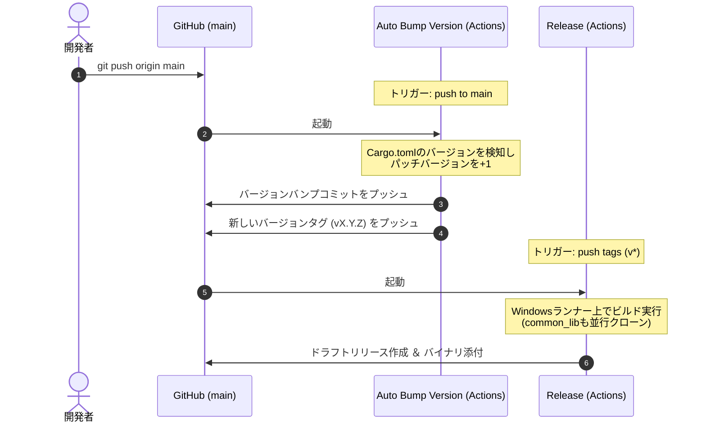

# リモートリリースおよびバージョン管理フロー手順書

本ドキュメントでは、Mini System Monitor (MiSysMon) におけるGitHub Actionsを利用した自動バージョン管理、およびリリースビルド（`.exe`アセット付ドラフトリリース）の作成フローとトラブルシューティングについて解説します。

---

## 1. 全体フロー概要

リポジトリでは、以下の2つのワークフローが連携して動いています。



---

## 2. 各ワークフローの役割

### ① Auto Bump Version (`bump-version.yml`)
- **トリガー**: `main` ブランチへのプッシュ（プルリクエストのマージ含む）。
- **処理内容**:
  1. `Cargo.toml` の `version`（X.Y.Z）を読み取る。
  2. パッチバージョンをインクリメント（X.Y.Z ➔ X.Y.Z+1）する。
  3. バージョン更新スクリプト（`scripts/bump-version.ps1`）を実行し、`Cargo.toml`、`docs/SPEC.md` などのバージョン表記を自動同期する。
  4. バンプ後のコミットを作成し、`main` ブランチにプッシュする（無限ループ防止のためコミットメッセージに `[skip ci]` を含む）。
  5. 新しいバージョンタグ（`vX.Y.Z`）を作成し、GitHubにプッシュする。

### ② Release (`release.yml`)
- **トリガー**: `v*` で始まるバージョンタグがGitHubにプッシュされた時。
- **処理内容**:
  1. `MiSysMon` と `common_lib` の双方のリポジトリを並行クローンする。
  2. Windows環境（`windows-latest`）上で、最適化オプションを適用してリリース用バイナリ（`mini-system-monitor.exe`）をビルドする。
  3. ビルドされたバイナリを添付し、GitHub上に「Draft Release（下書きリリース）」を自動作成する。

---

## 3. 重要：Personal Access Token (PAT) が必要な理由

GitHub Actionsの自動化において、**GitHub Secretsに `PAT` という名前でPersonal Access Tokenを登録すること**が推奨されます。

### なぜデフォルトの `GITHUB_TOKEN` では動かないのか？
GitHubには、**「Actionsの標準ボットトークン（`GITHUB_TOKEN`）によってプッシュされたイベントは、別のActionsワークフローをトリガーしない」**というセキュリティ制限（無限ループ防止）があります。

- **PATがない場合**:
  `Auto Bump Version` がプッシュしたバージョンタグ（例: `v0.1.7`）はボットによるプッシュとみなされ、**`Release` ワークフローが起動しません**。
- **PATがある場合**:
  ボットの代わりに「人間の権限（PATの持ち主）」としてタグがプッシュされるため、GitHubはこれを安全と判断し、自動的に `Release` ワークフローが連動して起動します。

> [!TIP]
> リポジトリ設定の `Settings` ➔ `Secrets and variables` ➔ `Actions` に、`repo` スコープを持つPersonal Access Tokenを **`PAT`** という名前で登録してください。登録されていない場合は、タグプッシュ時に自動的に `github.token` にフォールバックしますが、リリースの自動連動は行われません（手動でのタグプッシュが必要になります）。

---

## 4. トラブルシューティングと手動操作

### Q1. 自動バージョンアップ後にリリースビルド（下書き）が作られない
**原因**: PATが未設定のため、ボットによるタグプッシュが無視された可能性があります。
**解決策**: ローカルから**ユーザー自身の権限で手動でタグをプッシュ**することで強制的に起動させます。
1. ローカルを最新の状態にします。
   ```bash
   git pull origin main
   ```
2. 新しいタグを作成し、プッシュします。
   ```bash
   git tag v0.1.x
   git push origin v0.1.x
   ```

### Q2. 手動でタグをプッシュしたのにActionsが動かない
**原因**: プッシュしたタグが指しているコミットが、すでに別のタグで実行済みのコミットと同じである場合、GitHub Actionsは重複実行を防止するためトリガーをスキップします。
**解決策**: タグを打ち直すか、新しいコミットを作ってからタグを付与します。
1. リモートとローカルのタグを一度削除します。
   ```bash
   git push origin :refs/tags/v0.1.x
   git tag -d v0.1.x
   ```
2. 空のコミットなどを追加してプッシュします。
   ```bash
   git commit --allow-empty -m "chore: force trigger release"
   git push origin main
   ```
3. 新しいコミットに対して再度タグを打ってプッシュします。
   ```bash
   git tag v0.1.x
   git push origin v0.1.x
   ```

---

## 5. リリースの公開手順（下書きから本番へ）

Actionsが完了すると、自動的に「下書き（Draft）」の状態でリリースが作成されます。この時点では一般公開されず、READMEのリリースバッジも赤いままです。

1. GitHubリポジトリの右メニューにある **「Releases」** をクリックします。
2. 対象リリースの横に黄色い **`Draft`** マークがあることを確認し、**「Edit」**（編集）をクリックします。
3. リリースノート等を確認・調整し、ページ下部の **「Publish release」**（リリースを公開）をクリックします。
4. 公開後、約5〜10分程度（キャッシュがクリアされた後）で、README上の最新リリースバッジが正常な緑色（バージョン表記）に切り替わります。
