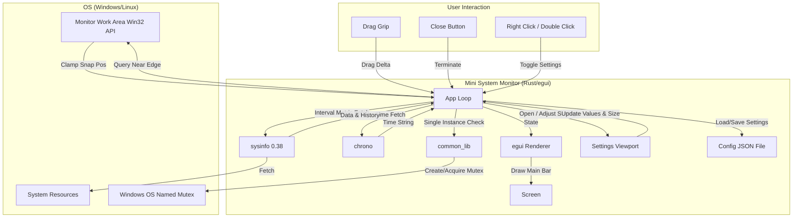

**English** | [日本語版](../ja/DIAGRAM.md)

# System Diagram

```mermaid
graph TD
    subgraph "OS (Windows/Linux)"
        SYS[System Resources]
        WIN[Windows OS Named Mutex]
        WA[Monitor Work Area Win32 API]
    end

    subgraph "Mini System Monitor (Rust/egui)"
        APP[App Loop]
        SI[sysinfo 0.38]
        CH[chrono]
        UI[egui Renderer]
        CL[common_lib]
        SET[Settings Viewport]
        CONF[Config JSON File]
        
        APP -->|Interval Metric Fetch| SI
        APP -->|Time Fetch| CH
        SI -->|Fetch| SYS
        SI -->|Data & History| APP
        CH -->|Time String| APP
        APP -->|State| UI
        UI -->|Draw Main Bar| SCR[Screen]
        APP -->|Single Instance Check| CL
        
        APP -->|Open / Adjust Settings| SET
        SET -->|Update Values & Size| APP
        APP -->|Load/Save Settings| CONF
    end

    subgraph "User Interaction"
        DRAG[Drag Grip] -->|Drag Delta| APP
        APP -->|Query Near Edge| WA
        WA -->|Clamp Snap Pos| APP
        CLOSE[Close Button] -->|Terminate| APP
        CLICK[Right Click / Double Click] -->|Toggle Settings| APP
    end

    CL -->|Create/Acquire Mutex| WIN
```
