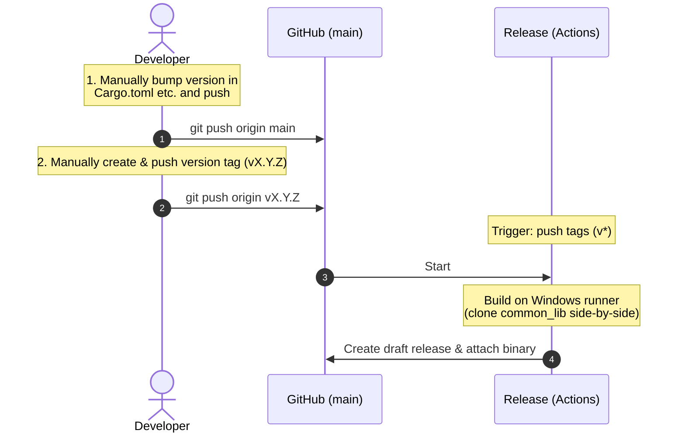

**English** | [日本語版](../ja/RELEASE_FLOW.md)

# Remote Release and Version Management Flow Manual

This document explains the workflow for creating release builds (draft releases with `.exe` assets) using GitHub Actions in Mini System Monitor (MiSysMon), along with troubleshooting tips.

---

## 1. Workflow Overview

The release process is triggered by developers manually bumping versions and pushing tags.



---

## 2. Roles of Workflows

### ① Release (`release.yml`)
- **Trigger**: When a version tag starting with `v*` is pushed to GitHub.
- **Workflow**:
  1. Clones both `MiSysMon` and `common_lib` repositories side-by-side.
  2. Builds the release binary (`mini-system-monitor.exe`) on a Windows runner (`windows-latest`) using release profiles.
  3. Uploads the build binary and automatically creates a "Draft Release" on GitHub.

---

## 3. Release & Tag Push Steps

Standard procedures to publish a release are as follows:

### 1. Version Bump and Push
Manually update version values in `Cargo.toml`, `docs/ja/SPEC.md`, `docs/en/SPEC.md`, etc., commit to `main`, and push:
```bash
git commit -a -m "chore(release): release v1.0.0"
git push origin main
```

### 2. Push Release Tag
Create and push a tag pointing to the latest commit:
```bash
git tag v1.0.0
git push origin v1.0.0
```
This triggers the release build workflow on GitHub Actions and automatically creates a draft release containing the binary.

---

## 4. Troubleshooting and Manual Actions

### Q1. Tag pushed manually but Actions did not trigger
- **Cause**: If the pushed tag points to a commit that has already run under a different tag, GitHub Actions skips execution to prevent duplicate runs.
- **Solution**: Delete the tag and create/push tag after adding a new commit:
  1. Delete remote and local tags:
     ```bash
     git push origin :refs/tags/v1.0.0
     git tag -d v1.0.0
     ```
  2. Push an empty commit:
     ```bash
     git commit --allow-empty -m "chore: force trigger release"
     git push origin main
     ```
  3. Re-tag the new commit and push:
     ```bash
     git tag v1.0.0
     git push origin v1.0.0
     ```

---

## 5. Publishing Release (From Draft to Public)

Once Actions finish, a release is automatically created in "Draft" state. At this point, it is not visible to the public, and the release badge in the README remains red.

1. Click **"Releases"** on the right side of the GitHub repository page.
2. Verify the yellow **`Draft`** mark next to the target release, and click **"Edit"**.
3. Check and adjust the release notes, then click **"Publish release"** at the bottom of the page.
4. After publishing, it takes about 5 to 10 minutes (after caches clear) for the latest release badge in the README to turn green (displaying the version).
